# Lab 3:  Image Composite, Mosaic, Subset
## Objective – Overview of Basic GRASS GIS Raster Functionality inside QGIS 

Document Version: 8/27/2014

**FOSS4G Lab Author:**
Richard Smith, Ph.D.  
Texas A&M University - Corpus Christi

**Original Lab Content Author:**
Nathan Jennings

---

Copyright © National Information Security, Geospatial Technologies Consortium (NISGTC)

The development of this document is funded by the Department of Labor (DOL) Trade Adjustment Assistance Community College and Career Training (TAACCCT) Grant No.  TC-22525-11-60-A-48; The National Information Security, Geospatial Technologies Consortium (NISGTC) is an entity of Collin College of Texas, Bellevue College of Washington, Bunker Hill Community College of Massachusetts, Del Mar College of Texas, Moraine Valley Community College of Illinois, Rio Salado College of Arizona, and Salt Lake Community College of Utah.  This work is licensed under the Creative Commons Attribution 3.0 Unported License.  To view a copy of this license, visit http://creativecommons.org/licenses/by/3.0/ or send a letter to Creative Commons, 444 Castro Street, Suite 900, Mountain View, California, 94041, USA.  

This document was original modified from its original form by Richard Smith and continues to be modified and improved by generous public contributions.

---

## 1. Introduction

This lab will provide an introduction and overview of some of the basic functionality of GRASS GIS inside QGIS 2.4 for working with raw image data to add and view image data sets.  Students are encouraged to become familiar with working with and finding information on GRASS GIS help topics.  It is also recommended to create screenshots and notes of software and of lecture slides that can make up a student’s notes.

This lab includes the following tasks:

+ Task 1 – Learn Basics of GRASS GIS inside QGIS
+ Task 2 – Image Composite
+ Task 3 – Image Mosaic
+ Task 4 – Image Subset
+ Task 5 – Calculate NDVI
+ Task 6 – Challenge: Image Subset with r.patch

## 2. Objective: Overview of Basic GRASS Raster Functionality inside QGIS

While QGIS has a large amount of functionality, it only goes so far before its limits are reached.  To extend the functionality of QGIS, the capabilities of GRASS GIS (or simply GRASS), have been made available through the ‘GRASS’ toolbar in QGIS.  GRASS is a free and open source GIS software package containing over 350 modules to display, analyze, and manipulate vector and raster data.  While GRASS is a separate, stand-alone GIS software package, in this lab series, we will only interact with GRASS through QGIS.  

Most students will be already be familiar with the vector-based GIS functions found within QGIS.  This lab introduces the student to the raster analysis functions in GRASS and creating some simple multi-band image composites from existing remotely sensed imagery, creating subsets (clipping) of rasters, and creating a mosaic.

## 3. How Best to Use Video Walk Through with this Lab

To aid in your completion of this lab, each lab task has an associated video that demonstrates how to complete the task.  The intent of these videos is to help you move forward if you become stuck on a step in a task, or you wish to visually see every step required to complete the tasks.

We recommend that you do not watch the videos before you attempt the tasks.  The reasoning for this is that while you are learning the software and searching for buttons, menus, etc…, you will better remember where these items are and, perhaps, discover other features along the way.  With that being said, please use the videos in the way that will best facilitate your learning and successful completion of this lab.

## Task 1 – Learn Basics of GRASS GIS inside QGIS

GRASS GIS is installed by default when you install QGIS Desktop. While GRASS is a completely stand-alone GIS software package, its capabilities are made available via a toolbar inside of QGIS.  This task will teach you the basic terminology and concepts of how GRASS manages data, as well as what each button the GRASS Toolbar does.

First, let’s start with some terminology and concepts.  Working with GRASS data is different than how you may be used to working with data using QGIS or other GIS software packages.  Since the storage paradigm is significantly different than what you have seen in prior courses, we will discuss how GRASS stores data first.  Refer to the figure below during the following explaination for a graphic representation of the storage concepts.

In order for GRASS to start a project, it must first connect to a Database (also called a GISDBase).  The Database is simply a folder on your computer that has special sub directories.  Once GRASS connects to a Database, it then needs to access a Location.  A Location is a child directory of the Database and stores the coordinate system or map projection that all enclosed Mapsets will use; think of a Location as a common container for a project.  A Mapset is a child directory of a Location that represents a geographical subset of its parent Location.  Mapsets contain geographic data in their directories.  There are two types of mapsets: Permanent and owner.  A Permanent mapset usually contains read-only geographic data that can be used by anyone.  The Permanent mapset also may contain other information about the Location that is not stored anywhere else, therefore, the Permanent mapset must exist in every Location.  Owner mapsets are user-created and represent specific areas or study sites within the Location.  Think of a mapset as a collection of geographic data that is project or user specific.  Owner mapsets can be named whatever logical name is desired.  Examples of mapset names are ‘user1’ and ‘Nueces County’, where ‘user1’ represents a mapset created by, or created for a user on the system, and ‘Nueces County’ represents a project dealing with Nueces County, Texas. Last, there is the concept of a Region.  A Region is a subset of a Location defined by a rectangular bounding box.  The Region is important for raster operations as it bounds the area (region) that will participate in any raster operations executed in GRASS.  A Region is an operating parameter set when working in GRASS.

If all of the above explaination was a little confusing, don’t worry, with practice in these labs, it will start to make more sense.

Now let’s talk about how you can access the data and functionality of GRASS inside QGIS.  Inside QGIS, there is a GRASS Toolbar that can be enabled (shown in figure below).

The GRASS Toolbar is separated in two sections.  The left section contains three buttons that manage the Mapsets.  Let’s discuss these three buttons first.

+ **Open Mapset**  - Opens the ‘Select GRASS Mapset’ dialog (shown in Figure 3) and allows you to set the Database (a.k.a. Gisdbase), Location, and Mapset for the current project.  When a Mapset is selected, all buttons on the GRASS Toolbar will be enabled.

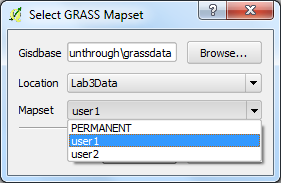

+ **New Mapset**  - Opens the ‘New Mapset’ wizard and walks you through the process of creating a new Mapset.
+ **Close Mapset**  - Closes the current Mapset.  Disables some buttons on the GRASS Toolbar.

The second section of the GRASS Toolbar allows for adding, creating, and editing geographic data, as well as accessing GRASS tools, and viewing and setting the Region.  Let’s discuss each of these buttons in more detail.

+ **Add GRASS Vector Layer**  - Opens the ‘Select GRASS Vector Layer’dialog and allows for adding a GRASS vector layer to the QGIS map canvas.  This button is enabled even if a Mapset is not currently opened.
+ **Add GRASS Raster Layer**  - Opens the ‘Select GRASS Raster Layer’ dialog and allows for adding a GRASS raster layer to the QGIS map canvas.  This button is enabled even if a Mapset is not currently opened.
+ **Create new Grass Vector**  - Allows for creating of a new GRASS Vector layer then opens a GRASS Edit session.
+ **Edit Grass Vector Layer**  - With a GRASS vector layer selected in the QGIS Layers List, opens the ‘GRASS Edit’ dialog and allows for editing of the vector layer.
+ **Open GRASS Tools**  - Opens the ‘GRASS Tools’ dialog box (shown in figures below).  This dialog box allows access to GRASS’s powerful tools (via Modules Tree and Modules List tabs) and a hierarchical view of the current Mapset (via Browser tab).

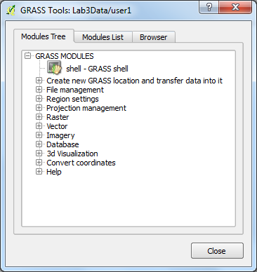

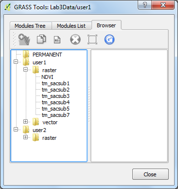

+ **Display Current Map Region**  - Displays the currently set map region as a rectangle on the map canvas.
+ **Edit Current Grass Region**  - Opens the 'GRASS Region Settings' dialog (shown in Figure 4) that allows for manual or interactive setting of the Region’s extent.  Also allows for setting of analysis cell resolution and symbol properties of map region rectangle (shown when 'Display Current Map Region' button is selected).

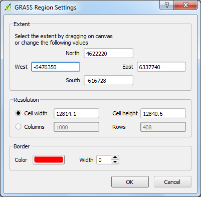

This task provided a brief overview of how GRASS can be used within QGIS.  This, and the subsetquent labs in this lab series, will only use a small subset of GRASS’s capabilities.  To learn more about GRASS GIS, visit the official webpage at <http://grass.osgeo.org/>

## Task 2 - Image Composite

An image composite is taking individual bands and putting them together into a single multi-band image data set.  In many cases, image data downloaded is provided this way where the end-user will need the ability to put imagery together.

1. Start QGIS 2.4 and enable the ‘GRASS’ toolbar.
2. On the GRASS toolbar, click Open Mapset button  . 
3. Set the following options on the ‘Select GRASS Mapset’ dialog then click OK:  
	+ Gisdbase: <Lab 3 Data folder>    
	+ Location: Lab3Data  
	+ Mapset: user1
4. Load the following image bands from the Lab3Data Location into QGIS by clicking ‘Add GRASS raster layer’ button   on the GRASS toolbar then selecting the individual images you wish to add (see figure below):  
	+ tm_sacsub1.tif
	+ tm_sacsub2.tif
	+ tm_sacsub3.tif
	+ tm_sacsub4.tif
	+ tm_sacsub5.tif
	+ tm_sacsub7.tif

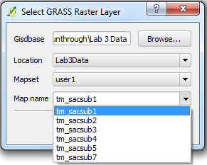

The six bands are from a Landsat TM satellite subset.  These will show up in the QGIS Layers list.  Note the wavelengths for these bands.  Refer to the lecture material or search the Internet on the Landsat sensor.

6.	Open GRASS Tools by clicking ‘Open GRASS Tools’  button on the GRASS toolbar.
7.	Open ‘Modules Tree’ tab.
8.	Expand the tree to find r.composite tool.  
	+ GRASS Modules
		+ Raster
			+ Manage map colors
				+ r.composite
9.	Double-click on r.composite tool to open it.
10.	Set the following options.  Refer to the figure below.
	+ Name of raster map to be used for <red>: tm_sacsuub3
		+ Click ‘Use region of this map’ button   
	+ Name of raster map to be used for <green>: tm_sacsuub2
	+ Name of raster map to be used for <blue>: tm_sacsuub1
	+ (1-256): 32  -- represents number of values for red
	+ (1-256): 32  -- represents number of values for green
	+ (1-256): 32-- represents number of values for blue
	+ Name for output raster map: Composite_32_TM_123
11.	Click ‘Run’ button to run the tool.  The dialog will switch to the Output tab to show the results of the tool.  If it does not say ‘Successfully finished’, re-check that you entered the options correctly, and run again.

12.	On the Output tab, with the r.composite tool successfully run, click View output button to add the composite raster to the QGIS Layers list.  You should now see a true color 3-band raster.

Let’s investigate this new raster a little more by viewing details about it in the GRASS Tools Browser.

13.	Open GRASS Tools and select the ‘Browser’ tab.
14.	Expand the user1-->raster branches to see all of the raster files in the mapset.
a.	If you do not see the newly created compsite raster (Composite_32_TM_123), click the Refresh button .
15.	Select Composite_32_TM_123 in the browser tree.  A list of properties describing the selected raster will display.

What are the Properties for the following?

+ Rows
+ Columns
+ Resolution
+ Format
+ Data description
+ Bands

16.	Using the same procedure as above, create a new composite raster using bands 4, 5, and 7.  Use the following band assignments:

+ Red: tm_sacsub4
+ Green: tm_sacsub5
+ Blue: tm_sacsub7

Your output composite should look like the figure below.  

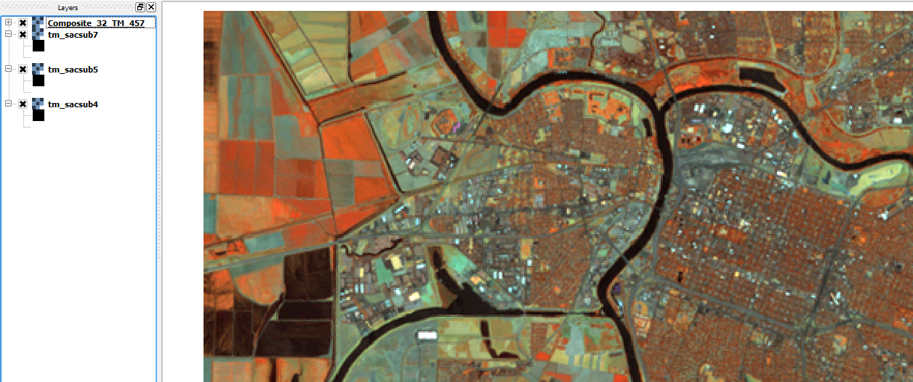

What sensor wavelengths are assigned to the following output image bands in the image just created?

+ Band 4 = 
+ Band 5 = 
+ Band 7 = 

Why are these colors displayed vs showing a true color type display?  Explain.

Create new composites to answer the following three questions.

1. Change the display to show a true color band combination (Red Display = Band 3, Green Display =Band 2, and Blue Display = Band 1).  Describe what you see and the colors of the features.  Based on the information from the lecture explain why the features appear as these colors in the color display.

2. Change the band combination to (Red Display = Band 4, Green Display to Band 3, and the Blue Display to Band 2).  Describe what you see and the colors of the features.  Based on the information from the lecture explain why the features appear as these colors in the color display.

3. Change the band combination to (Red Display = Band 4, Green Display to Band 5, and the Blue Display to Band 3).  Describe what you see and the colors of the features.  Based on the information from the lecture explain why the features appear as these colors in the color display.

## Task 3 - Image Mosaic

This task will walk through the steps to generate a simple image mosaic to merge adjacent images from the same sensor with the same number of bands.  

1.	Start QGIS 2.4 and enable the ‘GRASS’ toolbar.  If QGIS is already open, create a new, empty project.
2.	On the GRASS toolbar, click Open Mapset button . 
3.	Set the following options on the ‘Select GRASS Mapset’ dialog then click OK:
	+ Gisdbase: <Lab 3 Data folder>
	+ Location: Lab3Data
	+ Mapset: user2
4.	Load the following image bands from the Lab3Data Location into QGIS by clicking ‘Open GRASS Tools’ button  on the GRASS toolbar then selecting the ‘Browser’ tab.
5.	Expand user2-->raster.
6.	Select the following rasters then press ‘Add selected map to canvas’ button  .
	+ subset1
	+ subset2
	+ subset3
	+ subset4
7.	Close GRASS Tools.
8.	Zoom to full extents on the map canvas.

Note that the four rasters are adjacent and represent one larger square area. Before we mosaic the rasters together, we first need to define the region that our newly mosaicked raster will fill.  A region can be thought of as a working window for raster processing.

9.	Open GRASS Tools.
10.	Click ‘Modules List’ tab.
11.	In the Filter input box, enter ‘region’.
12.	Double-click on the g.region.multiple.raster tool to open it.
13.	Set the following options for the g.region.multiple.raster tool (refer to Figure 8):
	+ Type in map names separated by a comma: subset1,subset2,subset3,subset4  *Note: Type the names in.*

14.	Click ‘Run’ button to execute the tool.  Close GRASS Tools.
15.	Zoom to full extent on the map canvas.

Notice that there is now a red outline surrounding the extents of the four subset rasters.  This red outline represents the current raster processing region.  The figure below illustrates what the region extent should look like (note that subset4 has been turned off to better illustrate the red outline).

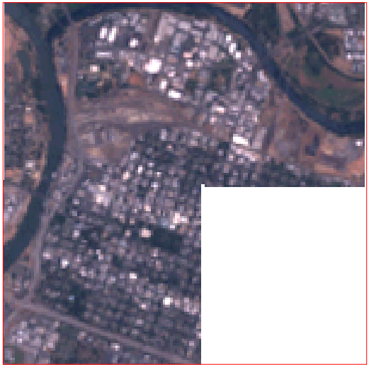

Now that the region has been set, we will now mosaic the rasters together in to a single, new raster.  To do this, we will utilize the r.patch tool.  The r.patch tool sets the current region’s cell values with the values of the specified rasters.  Therefore, since the current region is filled by our four rasters, the values from each of the four rasters will transfer to the new, moasiced, raster which has the same size as the current region.

16.	Open GRASS Tools.
17.	Click ‘Modules List’ tab.
18.	In the Filter input box, enter ‘patch’ to quickly find the r.patch tool.
19.	Double-click on the r.patch tool to open it.  
20.	Set the following options for the r.patch tool (refer to figure below):
	+ Name of raster maps to be patched together: subset1
	+ Name of raster maps to be patched together: subset1,subset2,subset3,subset4   *Note: Type the names in.*
	+ Name for resultant raster map: mosaic
21.	Click ‘Run’ button to execute the patch tool.

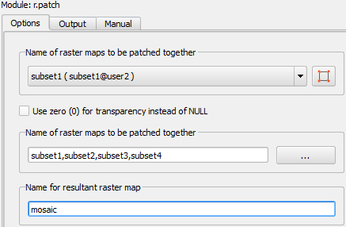

22.	Add the newly created mosaic to the QGIS canvas to view the newly created mosaic.  Turn off the visibility of the subset rasters to verify that the mosaic is complete.

## Task 4 - Image Subset

This task will walk through the steps to generate an Image Subset.

1.	Start QGIS 2.4 and enable the ‘GRASS’ toolbar.  If QGIS is already open, create a new, empty project.
2.	On the GRASS toolbar, click Open Mapset button . 
3.	Set the following options on the ‘Select GRASS Mapset’ dialog then click OK:
	+ Gisdbase: <Lab 3 Data folder>
	+ Location: Lab3Data
	+ Mapset: user2
4.	Load the ‘mosaic’ raster from Task 3 on the map canvas.
5.	On the GRASS Toolbar, click ‘Edit Current GRASS Region’ button .  This will open the GRASS Region Settings dialog box.

The current region can be set in two ways using this dialog box.  The first way is to manually enter the four extent values.  The second way is to drag a box on the map canvas to set the four extent values.  We will use the second option and drag a box.

6.	Move the GRASS Region Settings dialog to the side of the screen, then drag a box inside the mosaic that is smaller than the mosaic.  See figure below for an example.

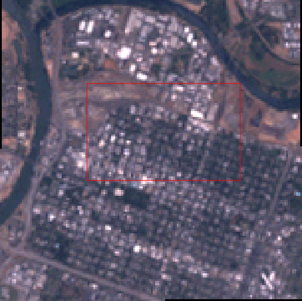

When you finish drawing the box, the GRASS Region Settings dialog reappears. The extent values are updated to match the extent of the drawn box.

The Resolution setting determines what cell size will be used in the region.  As we wish to stay at the same cell size, we will set the Cell width and Cell height to 30.  

7.	On the GRASS Region Settings dialog, set the following:
	+ Cell width: 30
	+ Cell height: 30
		+ *Note that the sizes may change slightly when you move between input boxes; this is normal.*
8.	Click OK to set the new region.
9.	Open GRASS Tools.
10.	Find and open the r.resample tool.
11.	Click on the 'Manual' tab of the tool and read the manual.  Every GRASS tool has a manual and are worth referencing when discovering their funcationality.
12.	Click the 'Options' tab of the tool and set the following options:
	+ Name of an input layer: mosaic
	+ Name of an output layer: smaller_mosaic
13.	Click Run to execute the tool.
14.	Verify that the smaller_mosaic was successfully created.

## Task 5 - Calculate NDVI

This task will teach you how to calculate NDVI.

1.	Start QGIS 2.4 and enable the ‘GRASS’ toolbar. If QGIS is already open, create a new, empty project.
2.	On the GRASS toolbar, click Open Mapset button . 
3.	Set the following options on the ‘Select GRASS Mapset’ dialog then click OK:
	+ Gisdbase: <Lab 3 Data folder>
	+ Location: Lab3Data
	+ Mapset: user1
4.	Load the following image bands from the Lab3Data Location into QGIS by clicking ‘Add GRASS raster layer’ button  on the GRASS toolbar then selecting the individual images you wish to add (see Figure 1)
d.	tm_sacsub3 – represents the red band
e.	tm_sacsub4 – represents the near infrared band
5.	Find and open r.mapcalculator tool.  Set the following options:
f.	A: tm_sacsub3
i.	Use region of this map  : selected
g.	B: tm_sacsub4
h.	Formula: float(B-A)/float(B+A)
i.	Name for output raster map: NDVI
6.	Run the tool and add the output to the map canvas.

At this point, you should have a black and white image that looks like the figure below.  While this is the calculated NDVI, it can be more visually appealing to assist the map reader in understanding where the healthy vegetation is located. To do this, we will apply a color table to the NDVI raster.

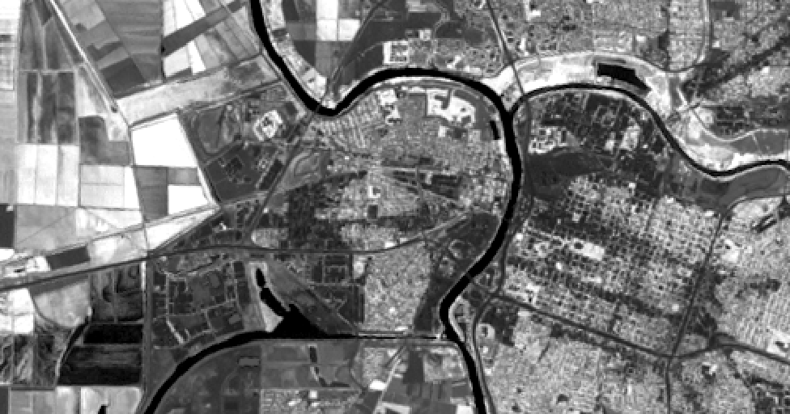

7.	In GRASS Tools, find and open r.colors.table.  Set the following options:
	+ Name of input raster map: NDVI
	+ Type of color table: Normalized Difference Vegetation Index colors
8.	Run the tool.  The raster will now look like the figure below.  If it does not, remove and re-add the NDVI raster to the map canvas.

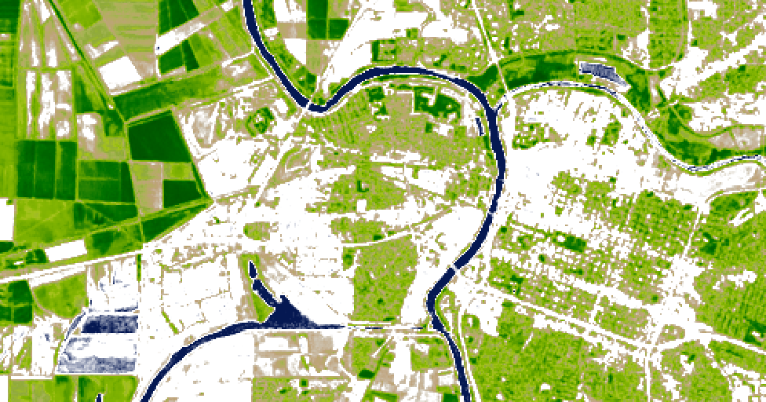

## Task 6 - Challenge: Image Subset with r.patch

Now that you know how to create an image subset with r.resample, determine how you would create an image subset with r.patch.  

## 4. Conclusion

In this lab, you have learned the basics of using GRASS Tools inside of QGIS to complete a composite, mosaic, and subset.  This lab just scratches the surface in terms of GRASS’s capabilities.  Future labs will delve deeper in to GRASS.

## 5. Discussion Questions

1. Answer the questions from Task 1.
	+ Create new composites to answer the following three questions.
		1. Change the display to show a true color band combination (Red Display = Band 3, Green Display =Band 2, and Blue Display = Band 1).  Describe what you see and the colors of the features.  Based on the information from the lecture explain why the features appear as these colors in the color display.

		2. Change the band combination to (Red Display = Band 4, Green Display to Band 3, and the Blue Display to Band 2).  Describe what you see and the colors of the features.  Based on the information from the lecture explain why the features appear as these colors in the color display.

		3. Change the band combination to (Red Display = Band 4, Green Display to Band 5, and the Blue Display to Band 3).  Describe what you see and the colors of the features.  Based on the information from the lecture explain why the features appear as these colors in the color display.
